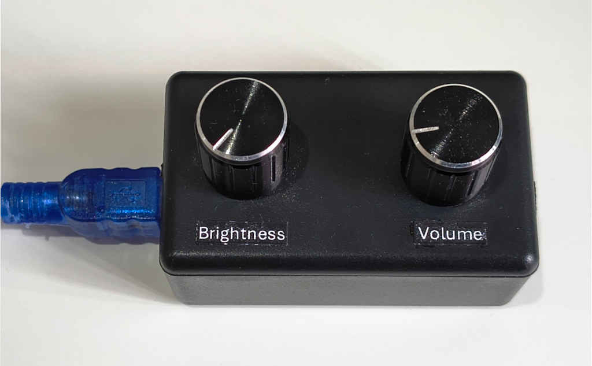
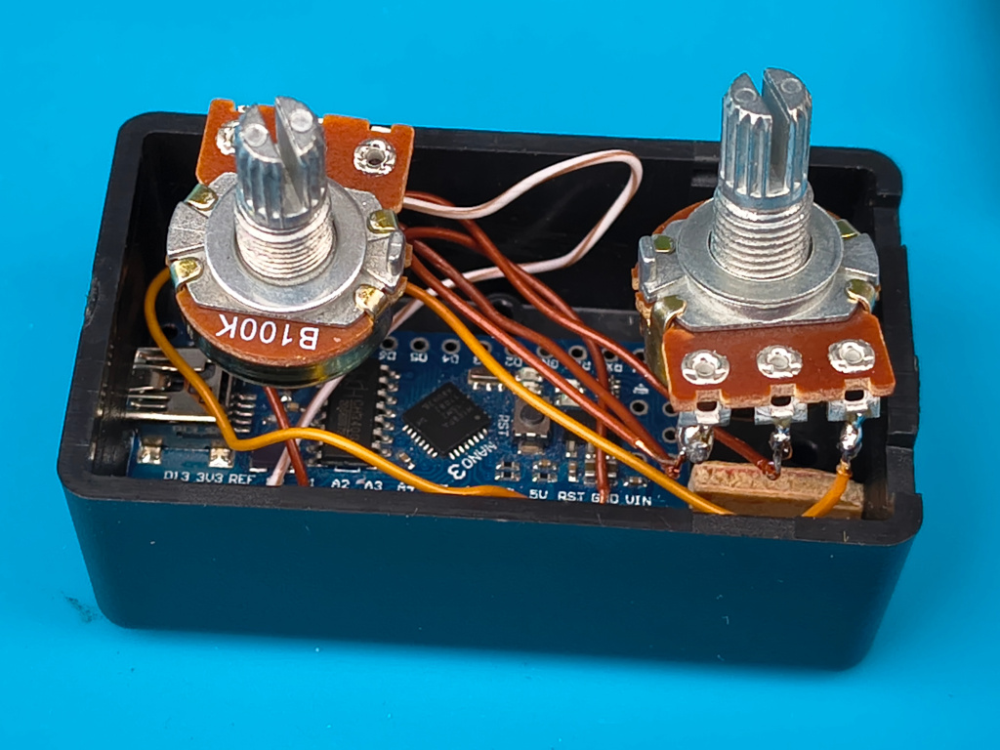

Analog inputs for brightness and for volume work really well. Forget having to repeatedly push `+`/`-` buttons to adjust a setting to the desired level. And forget having to navigate an onscreen settings menu to adjust the brightness (as was the case with my LG C2).

The knobs can be rotated 270°; fine and course adjustments can be made quickly and easily.

The hardware is custom made because I couldn't find an existing product like it. I had tried using a macro pad with rotary encoders but the experience wasn't ideal:
- The indicator line on the knobs didn't give an indication of what was selected.
- There was no tactile/visual feedback once a minimum or maximum was reached.
- The rotary encoders on my macro pad have twenty clicks per complete rotation and weren't suited for making fine adjustments.

The device contains an [Arduino Nano](https://docs.arduino.cc/hardware/nano/). Volume and brightness values are sent by the Arduino Nano by USB. PC software then forwards the values of the settings to the display.

## Software

### Arduino Nano

The board, COM port, and processor need to be set in [Arduino IDE](https://docs.arduino.cc/software/ide/). (By default the wrong processor was selected; I had to select ATmega168 from under "Tools/Processor".)

### MS Windows

- Install [LGTV Companion](https://github.com/JPersson77/LGTVCompanion). 
I originally installed [LGTV Companion](https://github.com/JPersson77/LGTVCompanion) on my PC to turn my screen on when I logged in (via Windows Hello) and to turn it off when the PC was shut down or went to sleep.
- Compile. Note that the COM port is hard-coded in [main.c++](MS_Windows/main.c++).
- The utility can be run on system start-up by starting "Task Scheduler" and adding a task ("Action/Create Basic Task...").

## Construction

I used an Arduino Nano with an ATmega168 processor.

The brightness potentiometer's wiper is connected to `A0` on the Arduino Nano. `A1` is used for volume.

100kΩ potentiometers were used. (10kΩ potentiometers may have been better as they may have resulted in less "jitter" from the A-to-Ds?)

The dimensions of the plastic box are 60x36x25mm. A small L-shape piece of plywood holds the Arduino Nano firmly in place. 

One reason for building this was that I thought it was an ideal small project to do with my seven-year-old son.
